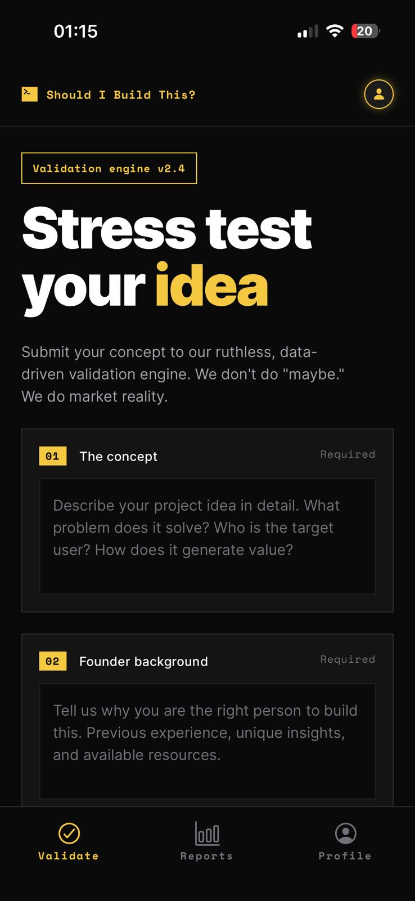
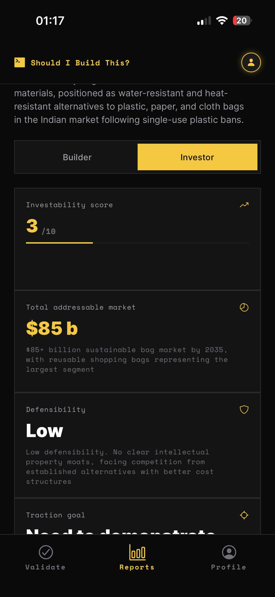
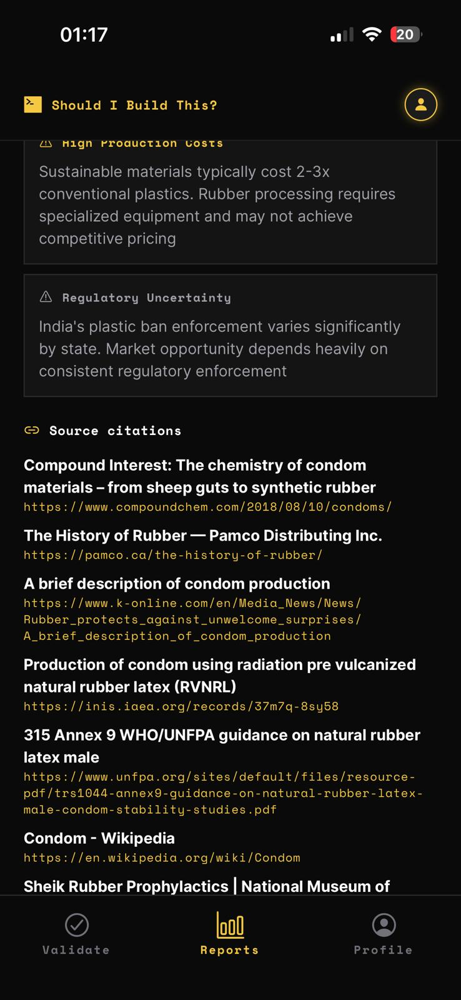
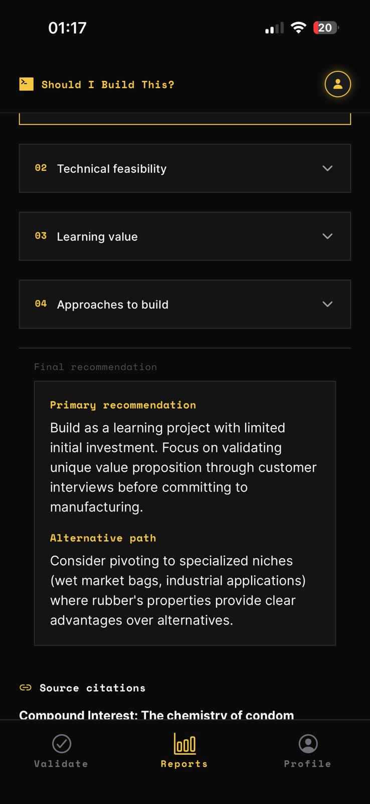

# Should I Build This?

Expo app that takes a startup idea plus founder background, sends it to a Supabase Edge Function backed by Anthropic, and returns a two-part report:

- Builder View
- Investor View

## App screenshots

| Validate | Loading |
| --- | --- |
|  |  |

| Builder report | Investor report |
| --- | --- |
|  |  |

## Stack

- Expo SDK 54
- React Native + Expo Router
- TypeScript
- NativeWind
- Supabase Postgres
- Supabase Edge Functions
- Anthropic Claude Sonnet 4

## Repo layout

- `app/`: Expo Router screens
- `components/`: UI building blocks and report session state
- `constants/`: runtime config and theme tokens
- `lib/`: API client and report shaping helpers
- `supabase/functions/analyze/`: backend function that calls Anthropic and writes to Postgres
- `docs/`: smoke test notes and design references

## Related docs

- [CLAUDE.md](/d:/WPI%20Things/Should%20I%20Build%20This/CLAUDE.md)
- [docs/stage-8-smoke-test.md](/d:/WPI%20Things/Should%20I%20Build%20This/docs/stage-8-smoke-test.md)
